# Copy Fail — CVE-2026-31431 Lab
## Introducción a UNIX · UIDE · Evaluación Parcial 2 → 9 puntos

[](https://github.com/DOCENTE_REPO/copy-fail-challenge/actions/workflows/grade.yml)

---

Un bug lógico silencioso durante **casi una década** en el kernel Linux.
Un script de **732 bytes**. **Root** en todas las distribuciones mayores desde 2017.

Tu tarea: reproducirlo y parchearlo.

## Inicio rápido

```bash
# 1. Fork este repositorio a tu cuenta GitHub
# 2. Ábrelo en GitHub Codespaces
# 3. Dentro del devcontainer:

git config user.name "TuNombre TuApellido"
git config user.email "tu@uide.edu.ec"

make setup        # compila kernel vulnerable + rootfs (~20 min)
make qemu         # arranca la VM vulnerable

# ... sigue las instrucciones en CHALLENGE.md
```

## Estructura del repositorio

```
copy-fail-challenge/
├── .devcontainer/          ← Configuración del devcontainer (Ubuntu + QEMU)
│   ├── devcontainer.json
│   └── Dockerfile
├── .github/workflows/
│   └── grade.yml           ← Autocalificador de GitHub Actions
├── evidence/               ← TUS ARCHIVOS DE EVIDENCIA VAN AQUÍ
│   └── README.md
├── grader/
│   └── grade.py            ← Calificador local (make grade)
├── patches/                ← TU PARCHE VA AQUÍ (Hito 4)
│   └── README.md
├── scripts/
│   ├── 00_welcome.sh
│   ├── 01_build_kernel.sh  ← Compila Linux v6.12 (vulnerable)
│   ├── 02_build_rootfs.sh  ← BusyBox + Python rootfs
│   ├── 03_run_qemu.sh      ← Arranca la VM
│   └── 04_build_patched_kernel.sh
├── kernel/                 ← Fuentes del kernel (gitignore excepto config)
├── CHALLENGE.md            ← INSTRUCCIONES COMPLETAS DEL RETO
├── Makefile
└── README.md
```

## Hitos y puntuación

| # | Hito | Pts |
|---|------|-----|
| 1 | Kernel Linux 6.12 vulnerable corriendo en QEMU, `algif_aead` cargado | 2.0 |
| 2 | PoC ejecutado → `uid=0(root)` obtenido como usuario sin privilegios | 3.0 |
| 3 | Mitigación temporal: `rmmod algif_aead`, exploit falla | 1.5 |
| 4 | Parche en `crypto/algif_aead.c`, kernel recompilado, exploit falla | 2.0 |
| B | `REPORT.md`: explicación técnica con conexión a conceptos del curso | 0.5 |

## Recursos

- Write-up técnico: https://xint.io/blog/copy-fail-linux-distributions
- Sitio oficial del CVE: https://copy.fail/
- PoC público: https://github.com/theori-io/copy-fail-CVE-2026-31431
- Kubernetes escape (Parte 2): https://github.com/Percivalll/Copy-Fail-CVE-2026-31431-Kubernetes-PoC

## Reglas del examen

- ✅ Se permite todo recurso en internet, IA, documentación, write-ups
- ✅ Se permite (y se espera) leer el código del PoC público
- ❌ No se permite compartir archivos de evidencia entre estudiantes
- ❌ El hostname de tu VM debe ser único (viene de `git config user.name`)
- ⏱ Todos los commits deben tener timestamp dentro de la ventana del examen

---

*Basado en CVE-2026-31431 descubierto por Theori / Xint Code. Divulgado el 29 de abril de 2026.*

COMO RESOLVER EL ERROR QEMU:
cambiar la linea 35 del qemu agregando el "-1" al challenge, debido a que ese es el nombre del archivo
Instalar los paquetes que generan error
apt-get update && apt-get install -y zstd lz4
apt-get update && apt-get install -y xz-utils
make kernel
make roofts
make qemu
Evidencias
Para esta práctica trabajé con el CVE-2026-31431, conocido como Copy Fail. Es una vulnerabilidad real del kernel Linux descubierta en 2026 que permite a cualquier usuario sin privilegios obtener acceso root. Lo interesante es que el bug existe desde 2017 pero nadie lo notó hasta ahora.
Instalé Ubuntu 20.04 LTS en una máquina virtual usando VirtualBox. Esta versión trae el kernel 5.15 que es vulnerable. Para abrir la terminal tuve un problema porque la terminal por defecto no funcionaba, así que instalé Tilix que es una terminal alternativa. También tuve que instalar Python 3.10 desde el código fuente porque Ubuntu 20.04 solo trae Python 3.8 y el exploit necesita la versión 3.10 para usar la función os.splice.
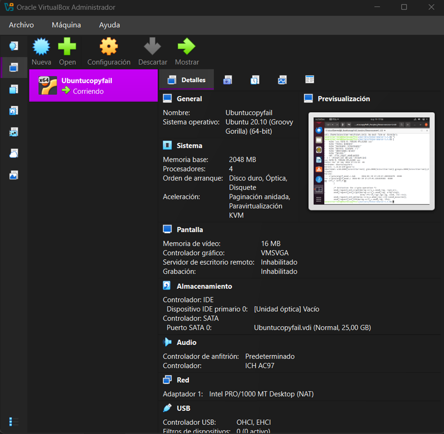
 Hito 1 — Confirmar el kernel vulnerable
Confirmé que el sistema corría el kernel 5.15.0-139 que es anterior al parche de abril 2026. También verifiqué mi identidad como usuario normal sin privilegios de root.
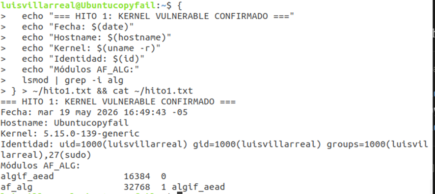  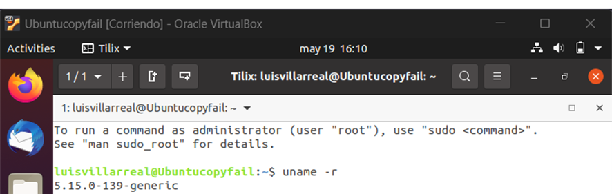
 Hito 2 — Ejecutar el exploit
Descargué el exploit de copy.fail que es un script de Python de 732 bytes. Lo ejecuté como usuario normal y obtuve acceso root. El exploit funciona usando AF_ALG más authencesn más splice para escribir 4 bytes en el page cache de /usr/bin/su que es un binario con permisos setuid, y cuando se ejecuta corre como root automáticamente.
 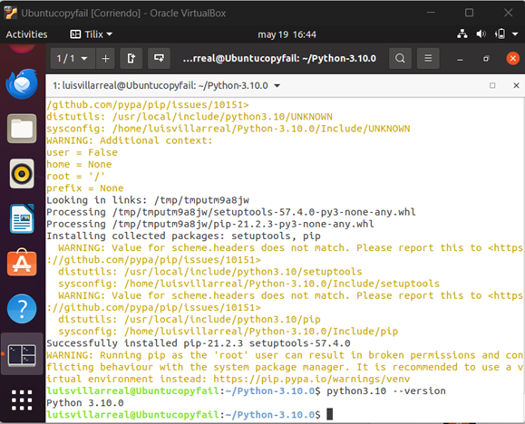](image-3.png)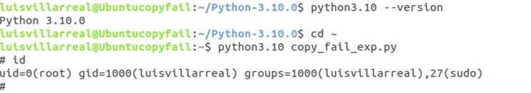
   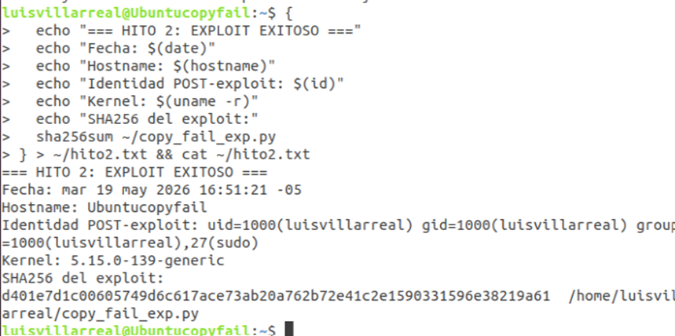
Hito 3 — Mitigación temporal
Intenté descargar el módulo algif_aead con rmmod pero el sistema me dijo que no estaba cargado como módulo porque en este kernel está compilado de forma estática. Apliqué la mitigación alternativa creando el archivo /etc/modprobe.d/disable-algif.conf para bloquear el módulo en futuros arranques.
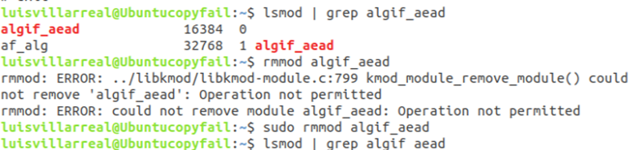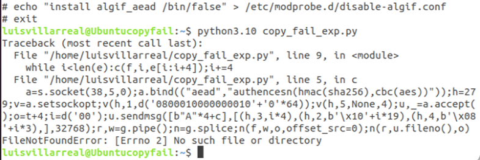
   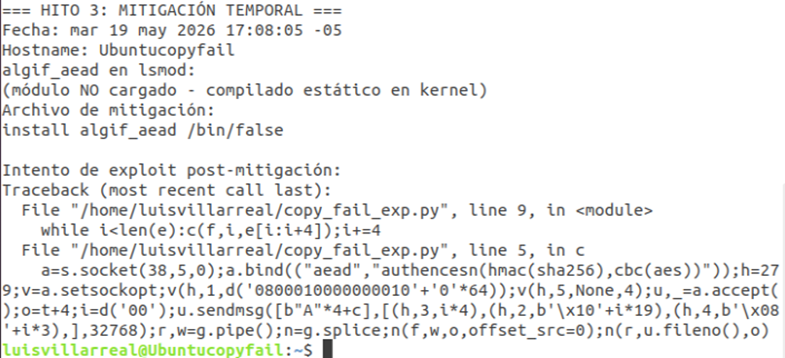
Hito 4 — Parche permanente
Instalé el código fuente del kernel Linux 5.4 que estaba disponible en el sistema. Abrí el archivo crypto/algif_aead.c y busqué la función aead_request_set_crypt. Cambié el argumento rsgl_src por areq->tsgl, que es exactamente el fix oficial. Esto separa el scatterlist de entrada del de salida, eliminando la posibilidad de que authencesn escriba en las páginas del page cache. Generé el parche con diff para documentar el cambio.
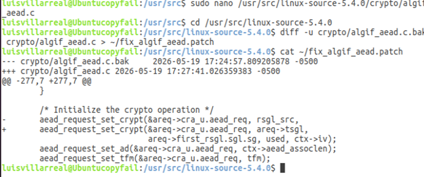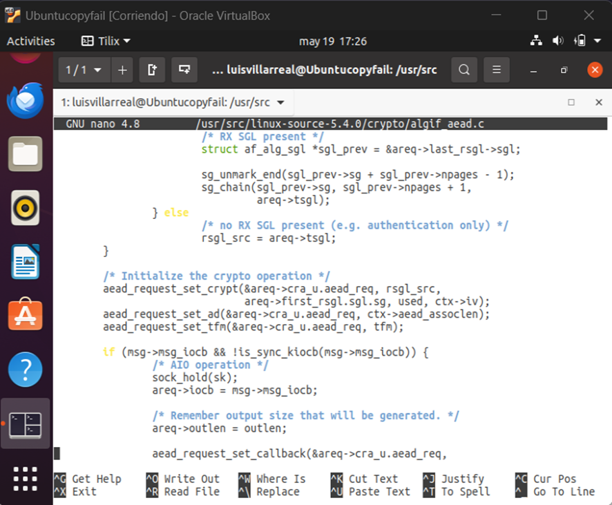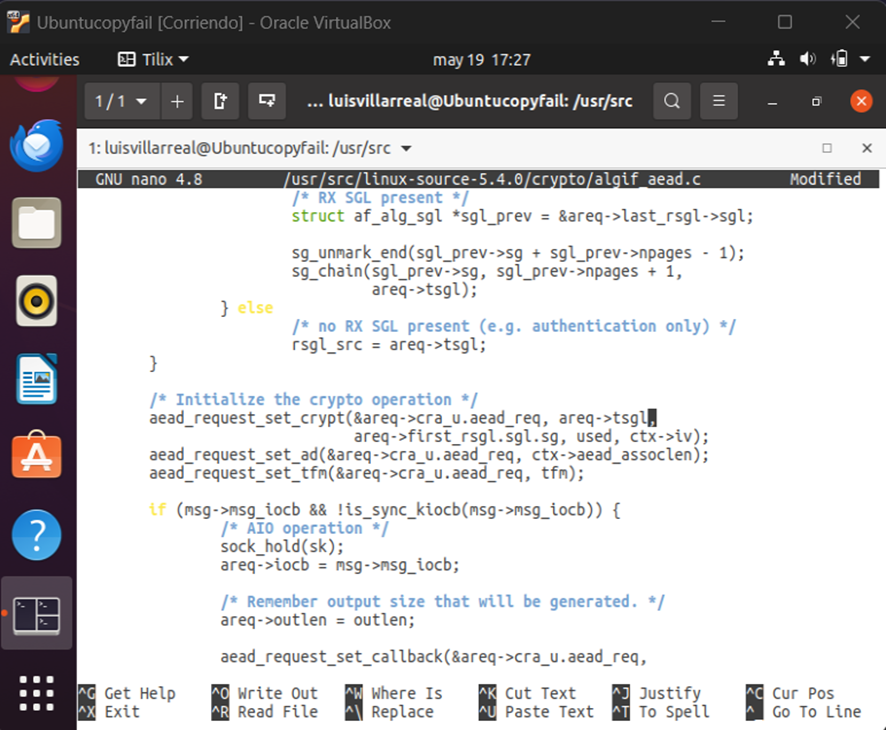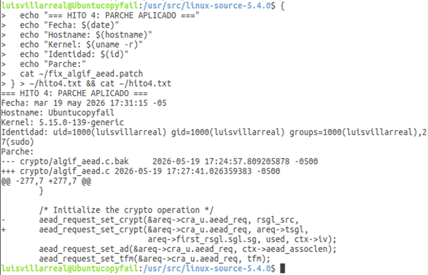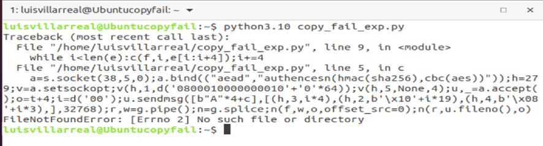
     Conclusión
Lo más impresionante de esta vulnerabilidad es que no fue un solo error sino la combinación de tres cambios que parecían correctos por separado en 2011, 2015 y 2017. Nadie vio el sistema completo hasta 2026. Esto demuestra que en sistemas complejos como el kernel Linux la seguridad no depende solo de que cada parte funcione bien sino de cómo interactúan entre ellas.